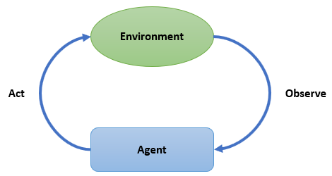
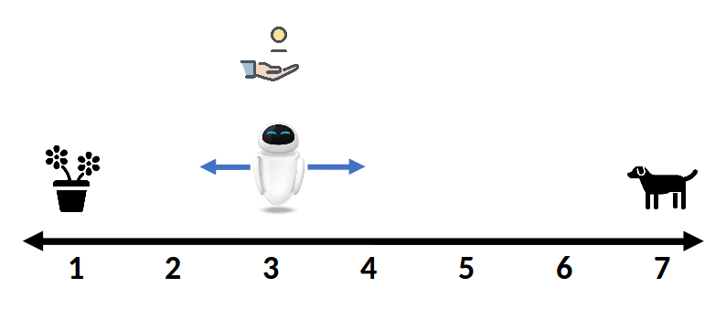

# Introduction to Reinforcement Learning

Before showing you a concrete example, let's review some of the key concepts in RL(Reinforcement Learning).



Generally speaking, RL is to learn how to make actions so as to maximize a numerical reward. Two main characters in RL problems are the **agent(s)** and the **environment**. By interacting with the unknown environment, the agent seeks to achieve a goal over time. From the perspective of an agent, it needs to know the observation space and the action space of an environment.

- **Observation Space**

    The **observation** of an environment could be a scalar, a vector, a matrix or a high order tensor(or a combination of them). For example, in video games we can usually use an `Array{Int8,3} to represent the observation at each time. The **Observation Space** tells the agent what kind of input the agent may observe.

- **Action Space**

    The **Action Space** defines what **actions** are valid to an environment. Just like observations, actions can also have different dimensions and can be discrete or continuous.

Some of the key concepts of an agent are that:

- **State**

    **State** is the agent’s internal representation of the observation from environment. It may or may not be the same with observation.

- **Reward**

    After taking an action in the environment, an agent will get a new state accompanied with a numeric reward. Our goal is to maximize some notation of cumulative rewards.

- **Policy**

    A policy is used to map a state to an action. It can be deterministic(a hash table) or stochastic(a parameterized classifier/approximator).

- **Experience Buffer** (or **Trajectories**)

    Buffer is used to store the agent’s experiences, including states, actions, rewards and/or some other environment information.

# Solving a Simple Random Walk Problem



Suppose our friend Eve starts at the position of 3 in the above figure. It can either move left or right randomly at each time step. If it meets the dog at position 7 then receives a reward of 3 and if it meets the flower at position 1 then receives a reward of 1. In all other cases, the reward is 0. Now consider that Eve choose to move to each direction with the same probability(the **policy**). And we would like to estimate the value of each position. So that we can further improve the policy.

First, let's initial the environment and the policy.

```julia
julia> using Ju

julia> using Random

julia> Random.seed!(123);  # to ensure that you get the same result as it is documented here

julia> policy = RandomPolicy([0.5, 0.5])
RandomPolicy{1}([0.5, 0.5])

julia> env = SimpleRandomWalkEnv()
SimpleRandomWalkEnv(7, 3, 3, [-1, 1])

julia> env(sample(actionspace(env)))
(observation = 2, reward = 0.0, isdone = false)

julia> reset!(env)
(observation = 3, isdone = false)
```

Since we want to estimate the value of each position, we choose an approximator of type `TabularV` to store and update our estimations(the value function).

```julia
julia> approximator = TabularV(length(observationspace(env)));
```

Then we need to decide how to update our estimations. There are many different kinds of algorithms. Here we use one of the simplest algorithms, the `MonteCarloLearner`. The basic idea behind `MonteCarloLearner` is that, we apply a policy until the end of an episode and then update the estimation of each state we have encountered by using following up rewards.

```julia
julia> learner = MonteCarloLearner(approximator, policy, 0.9, 0.1);
```

Here we set the discount rate to `0.9` and the step size of updating to `0.1`.

Then we use a `EpisodeSARDBuffer` to store the *S*tate, *A*ction, *R*eward, is*D*one at each time step.

```julia
julia> buffer = EpisodeSARDBuffer();
```

Combining all the components above, now we have our agent.

```julia
julia> agent = Agent(learner, buffer);
```

Finally, we can train our agent!

```julia
julia> train!(env, agent);
```

Every time we call `train!(env, agent)`, the `agent` will generate an action according to its policy and feed it into the `env`. Then the `env` will consume the action and return a reward, isdone and next state.

```julia
julia> agent.buffer
1-element EpisodeTurnBuffer{(:state, :action, :reward, :isdone),Tuple{Int64,Int64,Float64,Bool},NamedTuple{(:state, :action, :reward, :isdone),Tuple{Array{Int64,1},Array{Int64,1},Array{Float64,1},Array{Bool,1}}}}:
 (state = 3, action = 2, reward = 0.0, isdone = false)
```

It will be too verbose to train our agent step by step. Fortunately, `train!` can accept an optional argument named `callbacks`. We can force the training to stop at some condition, like stop at the end of an episode.

```julia
julia> callbacks=(stop_at_episode(1),);

julia> train!(env, agent;callbacks=callbacks);

julia> agent.buffer
8-element EpisodeTurnBuffer{(:state, :action, :reward, :isdone),Tuple{Int64,Int64,Float64,Bool},NamedTuple{(:state, :action, :reward, :isdone),Tuple{Array{Int64,1},Array{Int64,1},Array{Float64,1},Array{Bool,1}}}}:
 (state = 3, action = 2, reward = 0.0, isdone = false)
 (state = 4, action = 2, reward = 0.0, isdone = false)
 (state = 3, action = 1, reward = 0.0, isdone = false)
 (state = 2, action = 2, reward = 0.0, isdone = false)
 (state = 3, action = 2, reward = 0.0, isdone = false)
 (state = 4, action = 1, reward = 0.0, isdone = false)
 (state = 3, action = 1, reward = 0.0, isdone = false)
 (state = 2, action = 1, reward = 1.0, isdone = true)

julia> agent.learner.approximator
TabularV([0.0, 0.06561, 0.0478297, 0.0531441, 0.0, 0.0, 0.0])
```

As you can see, the `agent.learner.approximator` has been updated a little. Then we increase the number of training episodes to 1000.

```julia
julia> callbacks=(stop_at_episode(1000),);

julia> train!(env, agent;callbacks=callbacks);
Progress: 100%|█████████████████████████████████████████| Time: 0:00:03
  episode:  1000

julia> agent.learner.approximator
TabularV([0.0, 0.896335, 0.851624, 1.00933, 1.41548, 2.13538, 0.0])
```

Now we get our estimation of each position under the discount rate of `0.9`.